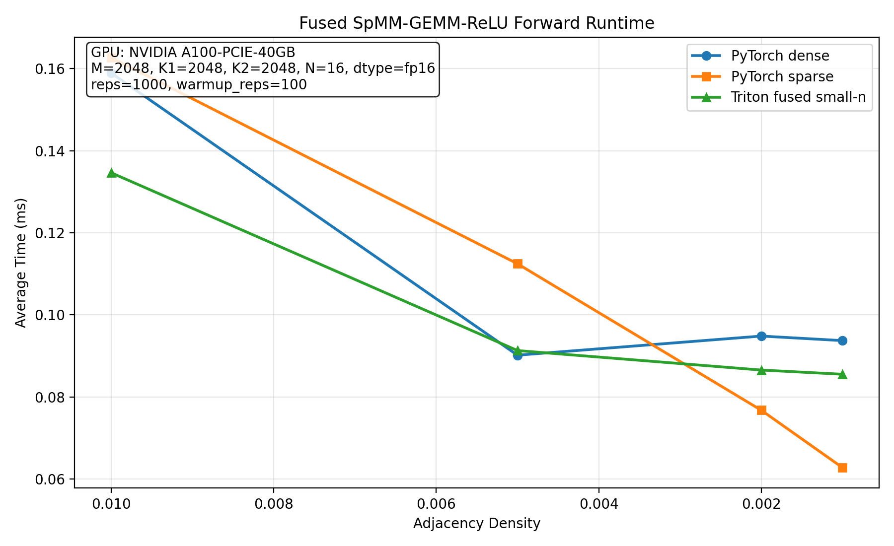

# GraphCUDA

GraphCUDA is a high-performance Graph Neural Network (GNN) library that leverages custom CUDA and Triton kernels and PyTorch C++/CUDA extensions for fast graph convolution and matrix operations. On benchmark datasets like **Cora**, GraphCUDA achieves **~10% faster training time** compared to PyTorch-native implementations. It is designed for research and benchmarking of GNNs on both sparse and dense graphs, with a focus on extensibility and speed.

<b>Please see this <a href="https://www.adityabang.com/blogs/fused-spmm-gemm-part-1" target="_blank">series of blog posts</a> to understand how the custom kernels for this library were built.</b>



## Features

- Custom CUDA and Triton kernels for GCN layers and matrix multiplication
- PyTorch extension with pybind11 for seamless Python integration
- Example implementations and benchmarks against PyTorch and torch-geometric

## Installation

### Prerequisites

- CUDA-capable GPU
- Python 3.11 or 3.12 (`>=3.11,<3.13`)
- CUDA Toolkit 12.8+ and a compatible NVIDIA driver
    - Windows: https://docs.nvidia.com/cuda/cuda-installation-guide-microsoft-windows/
    - Linux: https://docs.nvidia.com/cuda/cuda-installation-guide-linux/
- C++17 compiler ([cl](https://visualstudio.microsoft.com/downloads/?q=build+tools) on Windows, GCC or Clang on Linux)
- [uv](https://docs.astral.sh/uv/getting-started/installation/) (installs dependencies and builds the package from `pyproject.toml`)

### Linux

```bash
uv venv
source .venv/bin/activate
uv pip install .
```

### Windows (x64 Native Tools Command Prompt for VS 2022)

```cmd
uv venv
.venv\Scripts\activate
set DISTUTILS_USE_SDK=1
uv pip install .
```

## Usage

After installation, you can import and use the CUDA-accelerated GCN layers and matrix multiplication functions directly from Python:

```python
import torch
from graphcuda import GCNConv

class GCN(nn.Module):
    def __init__(self, input_dim: int, hidden_dim: int, output_dim: int):
        super().__init__()
        self.conv1 = GCNConv(input_dim, hidden_dim, cached=True, add_self_loops=True, bias=True, apply_relu=True)
        self.conv2 = GCNConv(hidden_dim, output_dim, cached=True, add_self_loops=True, bias=True, apply_relu=False)

    def forward(self, data):
        x = self.conv1(data.x, data.edge_index)
        x = F.dropout(x, training=self.training)
        x = self.conv2(x, data.edge_index)
        return F.log_softmax(x, dim=1)

model = GCN(in_features, hidden_features, out_features)
output = model(x, adj)
```

See `benchmarks/bench_gcn.py` for full training and benchmarking scripts.

## Project Structure

```
benchmarks/              # GCN and fused kernel benchmark scripts
csrc/                    # C++ bindings and custom CUDA kernels
plots/                   # Generated benchmark plots
src/graphcuda/
    modules/             # User-facing neural network layers
    ops/                 # Fused SpMM-GEMM-ReLU implementations
    utils/               # Sparse formats and initialization helpers
tests/                   # Unit tests and validation scripts
legacy/                  # Older prototype kernels and experiments
CMakeLists.txt
setup.py
pyproject.toml
```

## Benchmarking

Running `python benchmarks/bench_gcn.py`

Sample Output (on A100-40GB):
```
Cora: nodes=2708, edges=10556, features=1433, classes=7, dtype=fp16
Epochs: warmup=1000, measured=10000, hidden_dim=16

Benchmarking pygeometric_gcn
pygeometric_gcn: total=13.243882s, avg_epoch=1.324ms, loss=0.0018, train_acc=1.0000, val_acc=0.7600, test_acc=0.7920

Benchmarking graphcuda_gcn
graphcuda_gcn: total=12.076949s, avg_epoch=1.208ms, loss=0.0004, train_acc=1.0000, val_acc=0.7740, test_acc=0.7860

GraphCUDA speedup vs PyG: 1.10x
```

## TODO

- maybe make custom class for my tensor bsr modified, not necessary tho.
- block row as prop of this class, function to figure out optimal block row size, must be mult of 16, give 16 for now.
- add pytest for gcn conv forward correctly computed compared to pyg, pass in same weights, test with same data, my fixtures for cora dataset.
- clean up matmul code/move to legacy, still have gemm in csrc tho
- add GraphSage layer

## Development steps

- Write fwd pass for spmm_gemm_relu in Triton.
- Write fwd pass for spmm_gemm_relu in CUDA for Ampere archs.
    - Optimize with swizzling/cp.async
- Look at CUTLASS/CuTe for Ampere optimizations
- Switch to Mojo/Gluon/CuTeDSL for Hopper+ archs.

## License

MIT License

---

For questions or contributions, please open an issue or pull request!
